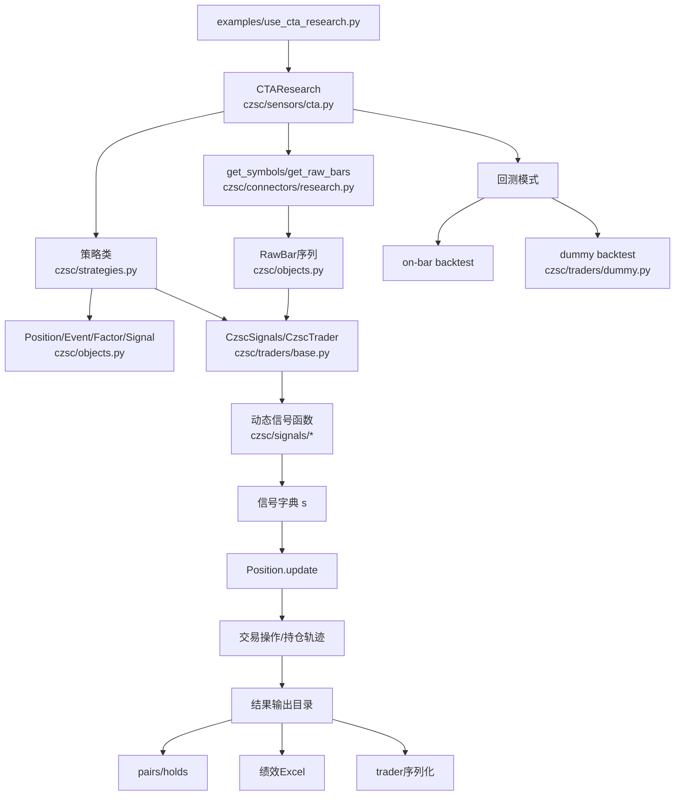

# CZSC 项目架构分析

本文档基于当前仓库代码结构整理，包含：项目架构、文件架构、系统架构（运行链路）与可视化架构图。

## 1. 项目架构（模块职责与依赖）

### 1.1 分层视角

- **数据接入层**：`czsc/connectors/*`  
  负责从不同数据源读取行情，统一成 `RawBar` / DataFrame 可消费形式。  
  典型：`czsc/connectors/research.py`（本地投研共享数据）。

- **领域模型层**：`czsc/objects.py`  
  定义交易系统核心对象：  
  `RawBar/NewBar/FX/BI/ZS`（行情结构） -> `Signal/Factor/Event`（决策规则） -> `Position`（仓位状态机）。

- **策略定义层**：`czsc/strategies.py`  
  定义策略抽象基类与示例策略；核心是给出 `positions` 和 `signals_config`，声明“何时开平仓”。

- **执行引擎层**：`czsc/traders/*`  
  `CzscSignals` 负责多周期信号计算，`CzscTrader` 负责按信号驱动持仓变化。  
  `DummyBacktest`、`WeightBacktest` 等负责不同回测执行模式。

- **研究编排层**：`czsc/sensors/*`  
  `CTAResearch` 将“数据读取 + 策略 + 回测流程 + 结果输出”封装成一键投研流程。

- **信号函数层**：`czsc/signals/*`  
  存放各类技术信号函数，供策略通过 `signals_config` 动态加载使用。

- **工具与基础设施层**：`czsc/utils/*`、`czsc/data/*`、`czsc/fsa/*`  
  提供绘图、统计、缓存、日历、数据客户端、飞书通知等横向能力。

### 1.2 核心依赖主链

`connectors -> strategies -> traders -> objects`  
`sensors/cta` 在上层编排这条链路，形成“可运行”的研究系统。

---

## 2. 文件架构（目录与关键文件）

## 2.1 顶层目录

- `czsc/`：核心源码包（分析、信号、策略、执行、连接器、工具）。
- `examples/`：可直接运行的示例脚本（本项目常用入口）。
- `test/`：单元测试与离线验证。
- `docs/`：文档与 Sphinx 配置。
- `.github/workflows/`：CI 工作流。

## 2.2 关键文件

- `setup.py`  
  定义包元信息、依赖、入口命令。命令行入口：`czsc = czsc.cmd:czsc`。

- `requirements.txt`  
  项目依赖集合（数据分析、绘图、回测、可视化、工程依赖）。

- `czsc/__init__.py`  
  Facade 门面层，统一导出常用 API（`CTAResearch`、`CzscTrader`、`Signal` 等）。

- `czsc/objects.py`  
  领域核心对象定义，支撑全系统“规则表达 + 交易状态机”。

- `czsc/strategies.py`  
  策略抽象与策略模板，定义策略如何组织 `positions/events/factors/signals`。

- `czsc/traders/base.py`  
  信号生成与逐K线执行引擎核心（`CzscSignals`、`CzscTrader`）。

- `czsc/traders/dummy.py`  
  离线批量回测执行器（on-signal 回测范式）。

- `czsc/sensors/cta.py`  
  CTA 投研流程总入口（backtest、dummy、replay、check）。

- `czsc/connectors/research.py`  
  本地投研数据读取与重采样（你的当前数据链路核心）。

- `examples/use_cta_research.py`  
  当前实际运行入口示例：创建 `CTAResearch` 并发起回测。

---

## 3. 系统架构（运行链路）

以下以 `examples/use_cta_research.py` 为主线说明系统如何工作：

1. **初始化研究任务**  
   脚本构造 `CTAResearch(strategy=..., read_bars=..., signals_module_name=...)`。

2. **读取标的与行情**  
   `get_symbols("中证500成分股")[:10]` 选择样本标的；  
   `get_raw_bars(...)` 从本地 parquet 读取并转成 `RawBar` 序列。

3. **策略装配**  
   策略类（如 `CzscStrategyExample2`）返回 `positions`；  
   每个 `Position` 由 `Event -> Factor -> Signal` 组成决策规则。

4. **信号计算**  
   引擎构建 `BarGenerator + CzscSignals`；  
   动态加载 `czsc.signals` 中函数，按多周期更新信号字典 `s`。

5. **交易决策**  
   `CzscTrader` 调用 `Position.update(s)`；  
   应用开平仓、止损、超时、间隔、T0 等约束，记录操作与持仓。

6. **回测执行模式**  
   - `backtest`：逐 bar 在线回放执行（on-bar）。  
   - `dummy`：先计算信号再批量执行（on-signal）。

7. **结果输出**  
   输出回测结果目录（交易对、持仓、绩效 Excel、trader 序列化、可选回放文件）。

---

## 4. 模块交互图（Mermaid）

---

## 5. 总结

- 这是一个典型的**规则驱动量化研究框架**：  
  数据接入 -> 信号计算 -> 事件决策 -> 仓位状态机 -> 回测输出。
- 代码组织比较清晰，核心价值在于：  
  `objects.py`（规则语义）+ `traders/base.py`（执行引擎）+ `signals/*`（可扩展信号库）+ `sensors/cta.py`（研究编排）。
- 你当前最常用的落地入口是：`examples/use_cta_research.py`。

量化数据提供商：
Tushare [https://tushare.pro/document/2?doc_id=14] 需要设置token
akShare
- 聚宽
- 东方财富
- 新浪财经
- 腾讯财经
- 网易财经
- 搜狐财经
- 凤凰财经
- 和讯财经
- 同花顺

